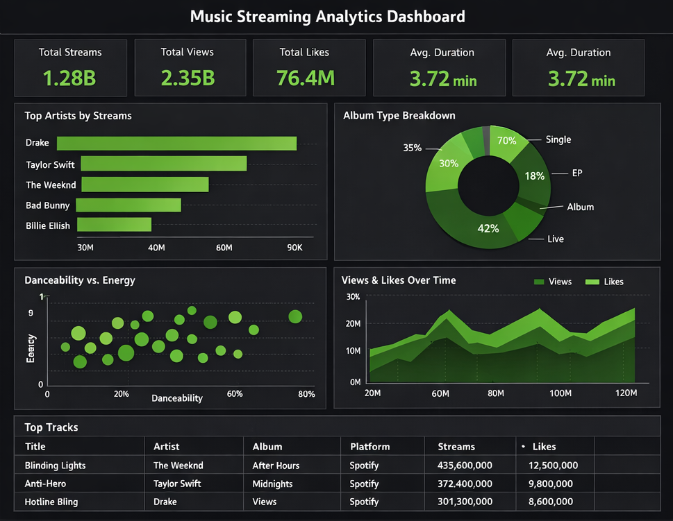
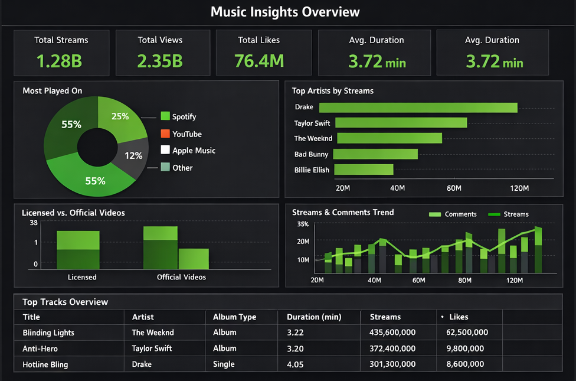

# Spotify Data Analysis (SQL + Power BI)

Analyze Spotify track data with SQL and visualize key insights in Power BI dashboards.


## 🎧 Dashboards

### 📊 Dashboard 1
<p align="center">
  
</p>

### 📊 Dashboard 2
<p align="center">
  
</p>

## Overview

This project demonstrates an end-to-end music analytics workflow:

- Clean and structure Spotify track data in SQL
- Analyze track and artist performance using aggregations, CTEs, and window functions
- Build Power BI dashboards for storytelling and decision-making
- Compare platform-level behavior (Spotify vs YouTube)

## 🛠 Tech Stack

- SQL (PostgreSQL-style queries)
- Power BI
- CSV dataset


```sql
-- create table
DROP TABLE IF EXISTS spotify;
CREATE TABLE spotify (
    artist VARCHAR(255),
    track VARCHAR(255),
    album VARCHAR(255),
    album_type VARCHAR(50),
    danceability FLOAT,
    energy FLOAT,
    loudness FLOAT,
    speechiness FLOAT,
    acousticness FLOAT,
    instrumentalness FLOAT,
    liveness FLOAT,
    valence FLOAT,
    tempo FLOAT,
    duration_min FLOAT,
    title VARCHAR(255),
    channel VARCHAR(255),
    views FLOAT,
    likes BIGINT,
    comments BIGINT,
    licensed BOOLEAN,
    official_video BOOLEAN,
    stream BIGINT,
    energy_liveness FLOAT,
    most_played_on VARCHAR(50)
);
```

Before diving into SQL, it’s important to understand the dataset thoroughly. The dataset contains attributes such as:
- `Artist`: The performer of the track.
- `Track`: The name of the song.
- `Album`: The album to which the track belongs.
- `Album_type`: The type of album (e.g., single or album).
- Various metrics such as `danceability`, `energy`, `loudness`, `tempo`, and more.


## 🗂 Dataset Information

Dataset File: `spotify_dataset.csv`  
SQL Script: `spotify.sql`  
Table Name: `spotify`

## ▶️ How to Use

1. Create the `spotify` table using the SQL script.
2. Import `spotify_dataset.csv` into the table.
3. Run the analysis queries in `spotify.sql`.
4. Use the generated outputs to build or validate Power BI dashboard insights.


## 📊 SQL Queries & Analysis

---

## 1️⃣ Tracks with More Than 1 Billion Streams

```sql
SELECT title, stream 
FROM spotify
WHERE stream > 1000000000;
```

---

## 2️⃣ List All Albums with Their Artists

```sql
SELECT DISTINCT album, artist
FROM spotify
ORDER BY 1;
```

---

## 3️⃣ Total Comments for Licensed Tracks

```sql
SELECT SUM(comments) AS total_comments
FROM spotify
WHERE licensed = 'true';
```

---

## 4️⃣ Tracks Belonging to Album Type "Single"

```sql
SELECT *
FROM spotify
WHERE album_type = 'single';
```

---

## 5️⃣ Total Number of Tracks by Each Artist

```sql
SELECT artist,
       COUNT(track) AS total_tracks
FROM spotify
GROUP BY 1;
```

---

## 6️⃣ Average Danceability per Album

```sql
SELECT album,
       AVG(danceability) AS avg_danceability
FROM spotify
GROUP BY 1
ORDER BY 2 DESC;
```

---

## 7️⃣ Top 5 Tracks with Highest Energy

```sql
SELECT track,
       MAX(energy_liveness) AS max_energy
FROM spotify
GROUP BY 1
ORDER BY 2 DESC
LIMIT 5;
```

---

## 8️⃣ Tracks with Official Video (Views & Likes)

```sql
SELECT track,
       SUM(views) AS total_views,
       SUM(likes) AS total_likes
FROM spotify
WHERE official_video = 'true'
GROUP BY 1
ORDER BY 2 DESC;
```

---

## 9️⃣ Total Views for Each Album

```sql
SELECT album,
       SUM(views) AS total_views
FROM spotify
GROUP BY 1
ORDER BY 2 DESC;
```

---

## 🔟 Tracks Streamed More on Spotify than YouTube

```sql
SELECT *
FROM (
    SELECT track,
           COALESCE(SUM(CASE WHEN most_played_on = 'Youtube' THEN stream END),0) AS streamed_on_youtube,
           COALESCE(SUM(CASE WHEN most_played_on = 'Spotify' THEN stream END),0) AS streamed_on_spotify
    FROM spotify
    GROUP BY 1
) AS t1
WHERE streamed_on_spotify > streamed_on_youtube
AND streamed_on_youtube <> 0;
```

---

## 1️⃣1️⃣ Top 3 Most Viewed Tracks per Artist (Window Function)

```sql
WITH ranking_artist AS (
    SELECT artist,
           track,
           SUM(views) AS total_views,
           DENSE_RANK() OVER(PARTITION BY artist ORDER BY SUM(views) DESC) AS rank
    FROM spotify
    GROUP BY 1,2
)
SELECT *
FROM ranking_artist
WHERE rank <= 3;
```

---

## 1️⃣2️⃣ Tracks with Above-Average Liveness

```sql
SELECT track,
       artist,
       liveness
FROM spotify
WHERE liveness > (SELECT AVG(liveness) FROM spotify);
```

---

## 1️⃣3️⃣ Energy Difference per Album (CTE)

```sql
WITH t1 AS (
    SELECT album,
           MAX(energy) AS highest_energy,
           MIN(energy) AS lowest_energy
    FROM spotify
    GROUP BY 1
)
SELECT album,
       highest_energy - lowest_energy AS energy_difference
FROM t1
ORDER BY 2 DESC;
```

---
## Business Insights

- Focus marketing on singles rather than albums.
- Invest more in official video production.
- Allocate greater promotional efforts on Spotify for tracks showing higher streaming performance relative to YouTube.
- Promote each artist’s top 3 highest-view tracks to maximize engagement and visibility.


## Author

SOHAIL ANSARI


